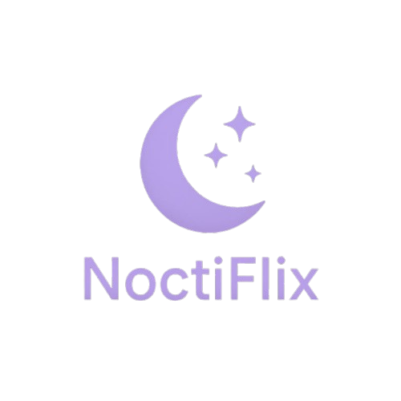

# 🌙 Noctiflix

**Noctiflix** is a minimalist movie discovery app built with React and The Movie Database (TMDb) API. It lets you search for movies, explore posters, and view short descriptions with a clean, fast, and dark-themed interface — perfect for midnight movie hunters.



## ✨ Features

- 🔎 Live movie search with debounce
- 🖼️ Display of movie posters, titles, and release years
- 🌙 Clean, responsive dark UI
- 🚀 Powered by TMDb API
- ⚛️ Built using React + Vite

## 🧪 Demo

> Try it live (link to deployment, e.g. Vercel/Netlify)

## 🛠️ Tech Stack

- **Frontend:** React, TailwindCSS
- **API:** [TMDb API](https://www.themoviedb.org/)
- **Build Tool:** Vite

## 📦 Installation

```bash
git clone https://github.com/your-username/noctiflix.git
cd noctiflix
npm install
